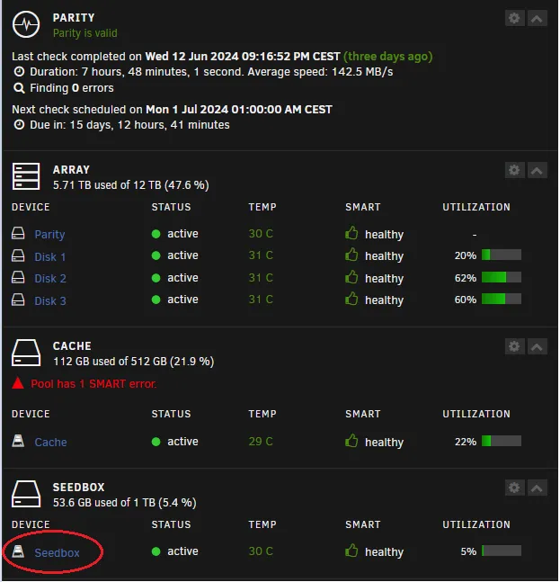

To install our stack on Unraid, we'll need the paid version of ZURG and then install the following Docker containers: RDTClient, Radarr, Sonarr, Plex.

You can purchase the paid version of ZURG on Patreon

We want to select an SSD disk outside the UNRAID array to speed up file interaction because we do not want to use parity

